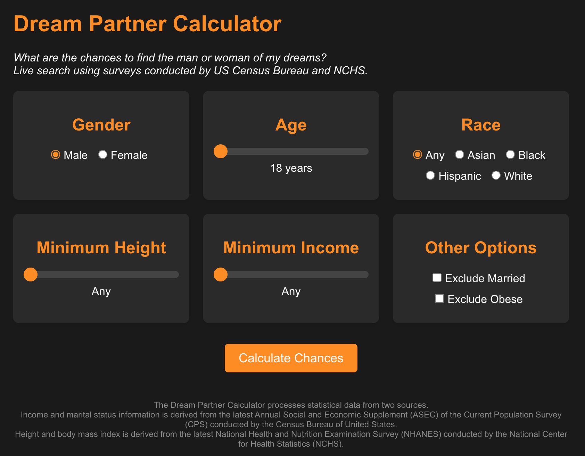

# Dream Partner Calculator

A data-driven web application that calculates the statistical probability of finding a partner with specific characteristics using official US demographic data.

## 📊 About

Dream Partner Calculator is an interactive tool that processes real demographic data from the US Census Bureau and National Center for Health Statistics to provide users with realistic insights about dating pool statistics. It helps users understand the statistical likelihood of finding a partner with their desired characteristics in the US population.

## ✨ Features

- 🔍 Filter by multiple demographic factors:
  - Gender preference
  - Age range
  - Race/ethnicity
  - Height requirements
  - Income thresholds
- 📈 Real-time statistical calculations
- 💫 Smooth, intuitive UI with slider controls
- 📱 Mobile-responsive design
- 🔒 Client-side processing for privacy

## 🛠️ Tech Stack

- React 18
- Modern CSS3
- Mobile-first responsive design

## 📊 Data Sources

The calculator processes statistical data from two primary sources:
- US Census Bureau's Annual Social and Economic Supplement (ASEC)
  - Income distribution
  - Marital status
  - Demographic information

- National Center for Health Statistics (NCHS)
  - Height distribution
  - Body mass index data
  - Health-related statistics

## 🎯 Future Enhancements

- [ ] Add more demographic filters
- [ ] Integrate real-time Census API data
- [ ] Add visualization charts
- [ ] Include geographic location filtering
- [ ] Add detailed statistical breakdowns
- [ ] Implement save/share functionality

## 📱 Screenshots

*Main calculator interface with demographic filters*